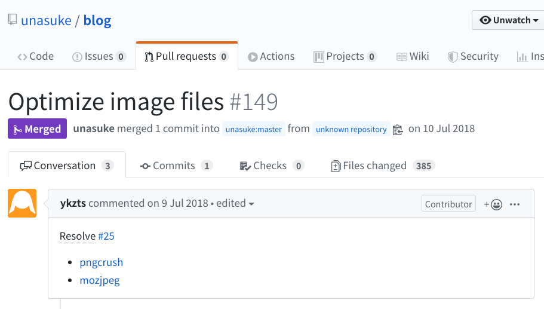
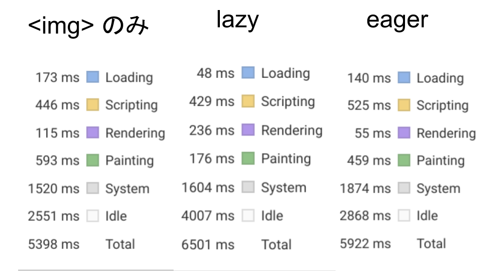

# Markdownで\\nLazy image loading
subtitle
: 2019-10-03

subtitle
: 表参道.rb #51

author
: うなすけ

theme
: unasuke-white


# 自己紹介
- 名前 : うなすけ
- 仕事 : 株式会社バンク (エンジニア)
  - インフラ寄りサーバーサイドエンジニア
  - Ruby, Rails, Kubernetes...

- {::tag name="x-small"}GitHub [@unasuke](https://github.com/unasuke){:/tag}
- {::tag name="x-small"}Mastodon [@unasuke@mstdn.unasuke.com](https://mstdn.unasuke.com/@unasuke){:/tag}
- {::tag name="x-small"}Twitter [@yu\_suke1994](https://twitter.com/yu_suke1994){:/tag}

{:relative_width="24" align="right" relative_margin_right="-10" relative_margin_top="42"}

# はじめに
See your [chrome://settings/help](chrome://settings/help)

{:relative_width="100"}

# Native lazy-loading from Chrome 75!
- [Native lazy-loading for the web  \|  web.dev](https://web.dev/native-lazy-loading)
- [AddyOsmani.com - Native image lazy-loading for the web!](https://addyosmani.com/blog/lazy-loading/)
- [遂に来る！ Chrome 75にてLazyLoadが正式に実装されるようです🎉 \| フロントエンドBlog \| ミツエーリンクス](https://www.mitsue.co.jp/knowledge/blog/frontend/201904/08_0854.html)

# loading="lazy"
Slimの場合

```slim
img(src="https://example.org/image.png" loading="lazy")
```

Hamlの場合

```haml
%img{src:"https://example.org/image.png", loading: "lazy"}
```

# loading="lazy"
Markdownの場合

```markdown

```

……いやいやいや

# Markdownの場合の理想
こう書いたら

```markdown

```

こうなってほしい

```html

```

# Markdownの場合の理想

{:.center}
{::tag name="x-large"}なぜそんなことを気にしているのか{:/tag}

# blog.unasuke.comの事情
- Middlemanと、blogプラグインによって生成されている
- 記事自体はMarkdownで書かれている
- 画像が重いというご意見がある

# 画像が重いというご意見
<https://github.com/unasuke/blog/pull/149>

{:relative_width="100"}

# つまりこういうこと
- blog.unasuke.comは画像が重いことに定評がある
- img に `loading="lazy"`を付けられたらいいかも？
- いやでもMarkdownやんけ…‥

# どういう手順で進めるか
理想

1. `loading="lazy"` で本当に早くなるのか計測
1. Markdownの変換結果になんとかして `loading="lazy"`をつける

実際

1. Markdownの変換結果になんとかして `loading="lazy"`をつける
1. 本当に早くなるのか計測

# なぜ計測ファーストでないか
- 変換結果に介入できることが検証できなければ、早くなることが確認できても実現できないため
- gemを作りたいという気持ちのほうが先にあった
- うっかり

# 実装やっていきましょう
- blog.unasuke.comではRedcarpetを使っている
  - <https://github.com/vmg/redcarpet>
- RedcarpetにはCustom Rendererを指定できる
- Custom Rendererで `image(link, title, alt_text)` の返り値をいじればできそう

see also
[Railsでカスタムmarkdownを実装する - k0kubun's blog](https://k0kubun.hatenablog.com/entry/2013/09/19/223400)

# Minimum code
```ruby
class CustomRenderer < ::Redcarpet::Render::HTML
  def image(link, title, alt_text)
    ""
  end
end
```

これでやりたいことは実現できる

# gemができました
<https://github.com/unasuke/redcarpet-render-html_lazy_img>

{:relative_width="40"}

# gemができました

```ruby
markdown = Redcarpet::Markdown.new(Redcarpet::Render::HTMLLazyImg::Lazy)
markdown.render('')
# => '<p></p>'

markdown = Redcarpet::Markdown.new(Redcarpet::Render::HTMLLazyImg::Auto)
markdown.render('')
# => '<p></p>'

markdown = Redcarpet::Markdown.new(Redcarpet::Render::HTMLLazyImg::Eager)
markdown.render('')
# => '<p></p>'
```

`loading` attributeの他の値にも対応
(auto, eager)

# Middlemanで使用するには
`config.rb`にこのように書けばOK

```ruby
set :markdown, renderer: Redcarpet::Render::HTMLLazyImg::Lazy
```

# では計測しましょう
使用するのは僕のブログ記事でも大量に画像を使用しているこの記事！

[TEX Yoda Trackpoint Keyboardを買った \| うなすけとあれこれ](https://blog.unasuke.com/2015/tex-yoda-trackpoint-keyboard-assembly/)

{:relative_width="30"}

# 計測方法
1. 上記記事をhtmlとしてローカルに保存
1. `` に何もなし、`loading="lazy"`, `loading="eager"`を指定したものの3つを用意
1. `chrome://flags/#enable-lazy-image-loading` を Enabledに
1. Chrome Developer toolsでloadingやperformanceを見る

※ もちろん Disable cacheの状態で

# 結果 (6回計測)
Load eventが発火するまでの時間

| | 最悪値 | 最速値 | 平均値 |
| -- | -- | -- | -- |
| pure img | 8.33 | 5.42 | 6.25 |
| lazy | 6.89 | 4.96 | 5.63 |
| eager | 7.83 | 4.97 | 6.47 |

Load eventはページ内の要素が全て読み込まれたら発火するのであまり意味のない計測だったかな……

# 結果 (1回のみ取得)
Performanceの結果

{:relative_width="100"}

# まとめ
- Loadingにかかる時間が削減されておりよさそう
- 画像のサイズは変わらないが、ページ自体は軽くなったのでは(サイズの話ではない)
- Webの最新技術を使うのは楽しい！！！
